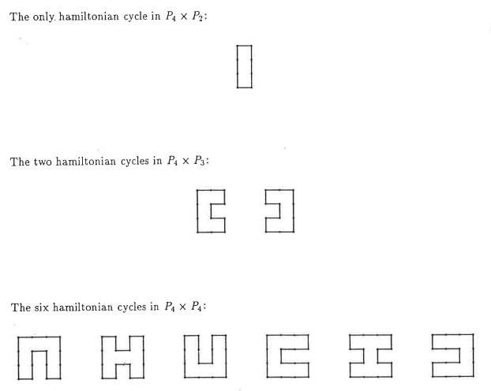

# CPTR 142: Objective #9 (1 point)

## Problem Overview

In this homework you will write a recursive function to do an arthmetic calculation.

## Scenario

Professor Tiffin's disertation titled "Enueration fo Hamiltonian Cycles and Paths in m x n Grid Graphs" defines a recurence relation for finding the the number of hamiltonian cycles in a 4 x n grid graphs.



The fomula is the following:

```text
A(1) = 0
A(2) = 1
A(3) = 2
A(4) = 6
A(n) = 2A(n-1) + 2A(n-2) -2A(n-3) + a(n-4) for n > 4
```

## Solution Specifications

Your solution to this problem must meet the following criteria.

1. You must implement the `getHamiltonianCycles` function in `hamiltonian_cycles.cpp` file which takes a long parameter.

1. You must use the recursion instead of iteration.

1. The `getHamiltonianCycles()` function implements the formula defined above..

1. You must format your code using the "Format Document" command in your development environment.

1. Your solution must work up to `n = 30`

1. The file `hamiltonian_cycles.cpp` should not contain a main program, it should only contain your function. To test your function, add code to the `test_driver.cpp` file. Note that code in `test_driver.cpp` will not be graded.

1. Below is an example of a call to the `getHamiltonianCycles` function which you could implement in `test_driver.cpp` to test your function.

    **C++ Code:**
    ```c++
    #include "hamiltonian_cycles.h"
    #include <iostream>

    int main() {
      std::cout << getHamiltonianCycles(1) << std::endl;
      std::cout << getHamiltonianCycles(2) << std::endl;
      std::cout << getHamiltonianCycles(3) << std::endl;
      std::cout << getHamiltonianCycles(4) << std::endl;
      std::cout << getHamiltonianCycles(5) << std::endl;
      return 0;
    }
    ```

    **Output:**
    ```html
    0
    1
    2
    6
    14
    ```

## Grade Specification

You will earn **two points** for completion of this homework problem once your solution passes all Submitty tests (indicated by all green bars).
